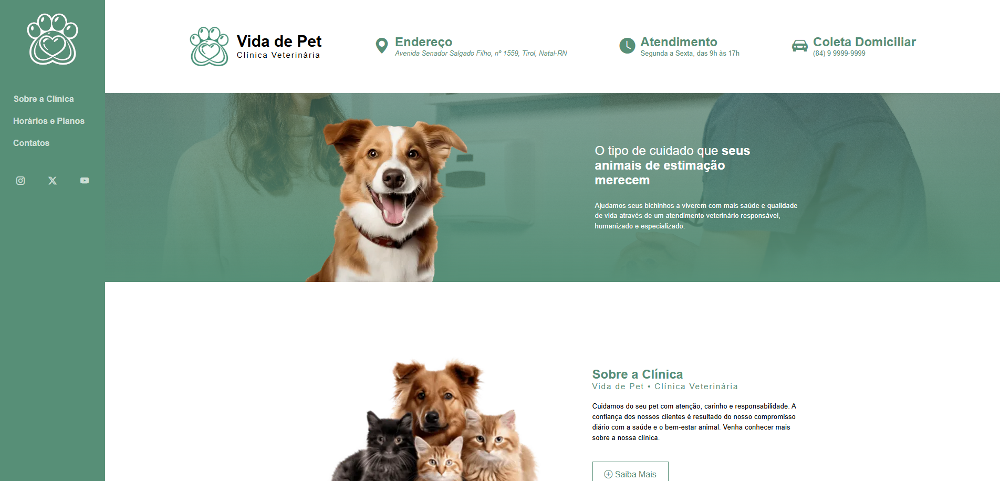
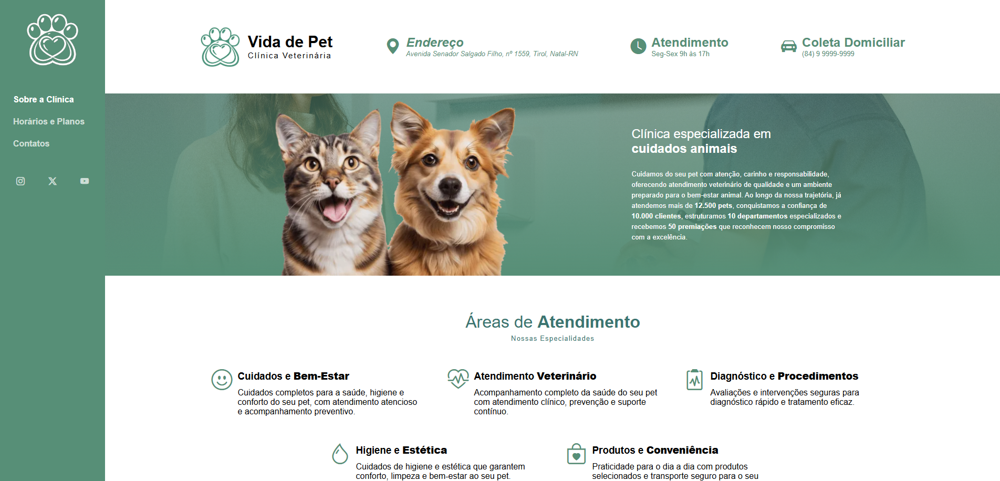
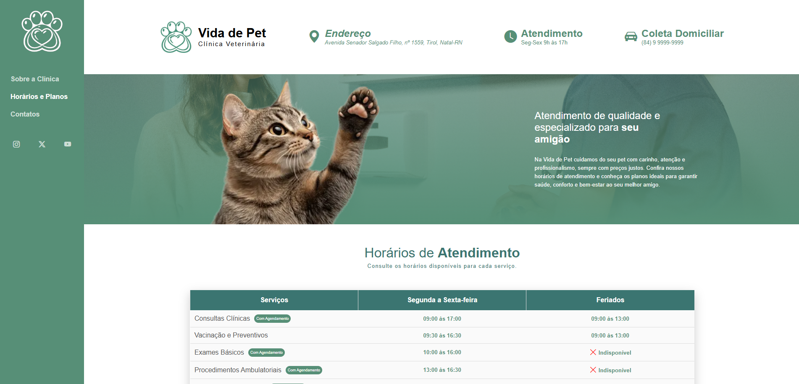
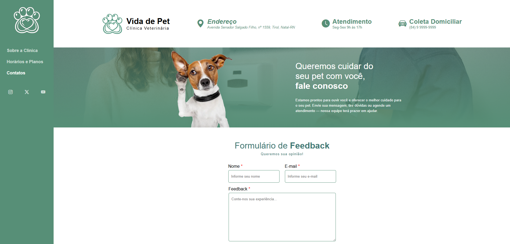

# 🚀 Vida de Pet - Clínica Veterinária

Site institucional fictício de uma clínica veterinária desenvolvido como desafio prático proposto no **Módulo II - HTML I: Conceitos Básicos do curso de HTML5** da [**DIO.me**](https://www.dio.me/). O projeto tem como objetivo aplicar os principais conceitos de HTML na construção de páginas web estruturadas, navegáveis e funcionais.

### Status do Projeto: ✅ Concluído

<br>

## 📋 Sobre o Projeto

O **Vida de Pet** é um site desenvolvido para simular a presença digital de uma clínica veterinária, apresentando informações institucionais, serviços, horários de atendimento, planos mensais e canais de contato para tutores de animais.

O projeto foi criado com foco no aprendizado dos fundamentos do desenvolvimento web utilizando HTML5, explorando elementos semânticos, formulários, tabelas, mídias e navegação entre páginas.

### Objetivo

Aplicar os conceitos fundamentais de HTML5 através da criação de um site completo e organizado, simulando um cenário real de negócio.

### Problema Resolvido

Muitas clínicas e pequenos negócios necessitam de uma presença digital para divulgar seus serviços, horários e formas de contato. Este projeto demonstra como construir uma solução web simples e eficiente utilizando apenas tecnologias básicas do front-end.

<br>

## ✨ Funcionalidades

### Funcionalidades Implementadas

* [x] Página inicial institucional
* [x] Página sobre a clínica
* [x] Página de serviços e horários de atendimento
* [x] Tabela de planos e serviços
* [x] Formulário de contato
* [x] Integração com mapa via iframe
* [x] Navegação entre páginas
* [x] Estrutura semântica utilizando HTML5
* [x] Inserção de imagens e conteúdos multimídia

<br>

## 🛠️ Tecnologias Utilizadas

### Front-end


### Ferramentas


<br>

## 🏗️ Arquitetura do Projeto

O projeto segue uma arquitetura simples baseada em páginas estáticas, organizadas por navegação interna entre documentos HTML.

Características da arquitetura:

* Estrutura baseada em páginas independentes
* Separação entre conteúdo (HTML) e estilização (CSS)
* Navegação por links internos
* Organização semântica utilizando elementos HTML5

<br>

## 📂 Estrutura de Diretórios

```text
vida-de-pet/
│
├── website/                 # Código-fonte do site
│   │
│   ├── assets/              # Arquivos estáticos utilizados pela aplicação
│   │   ├── css/             # Folhas de estilo CSS
│   │   └── images/          # Imagens utilizadas nas páginas
│   │
│   ├── index.html           # Página inicial da clínica
│   ├── about.html           # Página institucional sobre a clínica
│   ├── services.html        # Página de serviços, horários e planos
│   └── contact.html         # Página de contato e localização
│
├── docs/                    # Documentação do projeto
│   │
│   └── pages/               # Imagens das páginas construidas
│
└── README.md
```

<br>

## ⚙️ Pré-requisitos

Antes de iniciar, você precisará ter instalado:

* Navegador Web (Chrome, Brave, Microsoft Edge, ...)
* Git (opcional)
* Editor de código (recomendado: VS Code)

<br>

## 🚀 Como Executar

### 1. Clonar o Repositório

```bash
git clone https://github.com/DevJoaoVitorB/clinica-veterinaria.git
```

### 2. Entrar na Pasta

```bash
cd website
```

### 3. Executar o Projeto

Abra o arquivo principal:

```bash
index.html
```

> [!IMPORTANT]
> Ou utilize a extensão **Live Server do VS Code** para uma melhor experiência.

<br>

## 📸 Screenshots

### Tela Inicial



### Sobre a Clínica



### Horários e Planos



### Contato



<br>

## 👨‍💻 Autor

| **DevJoaoVitorB** |
| ----------------- |
|  |
| [](https://github.com/DevJoaoVitorB) [](https://www.linkedin.com/in/devjoaovitorb) |
